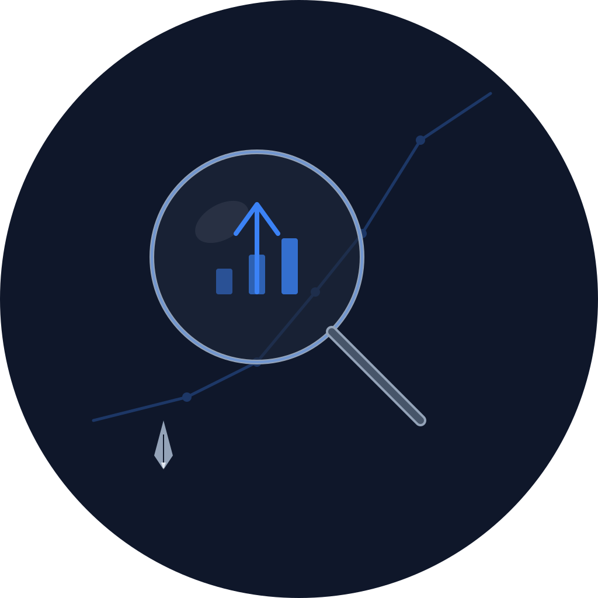

<p align="center">
  
</p>

# Turiso

[](https://github.com/svo/turiso/actions/workflows/development.yml)
[](https://github.com/svo/turiso/actions/workflows/builder.yml)
[](https://github.com/svo/turiso/actions/workflows/service.yml)

Docker image running an [OpenClaw](https://docs.openclaw.ai) gateway that syncs Instagram saved collections to Google Maps Lists. Give it a collection name like "Chile 2026" and it will review each saved post, determine its location, and pin it on a Google Maps List with the same name.

## How It Works

1. You send a message via Telegram: "Sync Chile 2026"
2. Turiso opens Instagram in a headless browser, navigates to your saved collection
3. For each post, it extracts the location (from location tags, captions, or image analysis)
4. It verifies each location using [GoPlaces CLI](https://github.com/steipete/goplaces) and the Google Places API
5. It opens Google Maps, creates (or updates) a list named "Chile 2026", and saves each location as a pin
6. It reports back with a summary of what was added and any posts it couldn't locate

## Prerequisites

* `vagrant`
* `ansible`
* `colima`
* `docker`
- An OpenAI API key
- An Instagram account
- A Google account
- A [Brave Search API](https://brave.com/search/api/) key (optional, for web search fallback)
- A [Google Places API](https://developers.google.com/maps/documentation/places/web-service/overview) key (optional, for location resolution via GoPlaces)

## Building

```bash
# Build for a specific architecture
./build.sh service arm64
./build.sh service amd64

# Push
./push.sh service arm64
./push.sh service amd64

# Create and push multi-arch manifest
./create-latest.sh service
```

## Running

```bash
docker run -d \
  --name turiso \
  --restart unless-stopped \
  --pull always \
  -e OPENAI_API_KEY="your-api-key" \
  -e BRAVE_API_KEY="your-brave-api-key" \
  -e GOOGLE_PLACES_API_KEY="your-google-places-api-key" \
  -e TELEGRAM_BOT_TOKEN="your-telegram-bot-token" \
  -e TELEGRAM_ALLOW_FROM="your-telegram-user-id" \
  -e TURISO_INSTAGRAM_USERNAME="your-instagram-username" \
  -e TURISO_INSTAGRAM_PASSWORD="your-instagram-password" \
  -e TURISO_GOOGLE_EMAIL="your-google-email" \
  -e TURISO_GOOGLE_PASSWORD="your-google-password" \
  -e TURISO_TIMEZONE="Australia/Melbourne" \
  -e TURISO_LOCALE="en-AU" \
  -v /opt/turiso/data:/root/.openclaw \
  -p 127.0.0.1:3000:3000 \
  svanosselaer/turiso-service:latest
```

On first run, the entrypoint automatically configures OpenClaw via non-interactive onboarding and sets up browser automation, web search, web fetch, and messaging access. Configuration is persisted to the volume at `/root/.openclaw` so subsequent starts skip onboarding.

## Environment Variables

| Variable | Required | Description |
|---|---|---|
| `OPENAI_API_KEY` | Yes | OpenAI API key for the OpenClaw gateway |
| `BRAVE_API_KEY` | No | [Brave Search API](https://brave.com/search/api/) key for web search |
| `FIRECRAWL_API_KEY` | No | [Firecrawl](https://firecrawl.dev) API key for enhanced web scraping |
| `GOOGLE_PLACES_API_KEY` | No | [Google Places API](https://developers.google.com/maps/documentation/places/web-service/overview) key for location resolution via [GoPlaces](https://github.com/steipete/goplaces) |
| `TELEGRAM_BOT_TOKEN` | No | Telegram bot token from @BotFather |
| `TELEGRAM_ALLOW_FROM` | With `TELEGRAM_BOT_TOKEN` | Comma-separated Telegram user IDs to allow |
| `TURISO_INSTAGRAM_USERNAME` | Yes | Instagram account username |
| `TURISO_INSTAGRAM_PASSWORD` | Yes | Instagram account password |
| `TURISO_GOOGLE_EMAIL` | Yes | Google account email for Google Maps |
| `TURISO_GOOGLE_PASSWORD` | Yes | Google account password for Google Maps |
| `TURISO_TIMEZONE` | Yes | Timezone for user context |
| `TURISO_LOCALE` | Yes | Spelling and language conventions |

## Telegram Integration

Connect Turiso to Telegram so you can trigger collection syncs directly from the Telegram app.

### Setup

1. Open Telegram and start a chat with [@BotFather](https://t.me/BotFather)
2. Send `/newbot` and follow the prompts to name your bot
3. Save the bot token that BotFather returns
4. Pass it as an environment variable when running the container:

```bash
docker run -d \
  --name turiso \
  --restart unless-stopped \
  -e OPENAI_API_KEY="your-api-key" \
  -e TELEGRAM_BOT_TOKEN="your-telegram-bot-token" \
  -e TELEGRAM_ALLOW_FROM="your-telegram-user-id" \
  -e TURISO_INSTAGRAM_USERNAME="your-instagram-username" \
  -e TURISO_INSTAGRAM_PASSWORD="your-instagram-password" \
  -e TURISO_GOOGLE_EMAIL="your-google-email" \
  -e TURISO_GOOGLE_PASSWORD="your-google-password" \
  -e TURISO_TIMEZONE="Australia/Melbourne" \
  -e TURISO_LOCALE="en-AU" \
  -v /opt/turiso/data:/root/.openclaw \
  -p 127.0.0.1:3000:3000 \
  svanosselaer/turiso-service:latest
```

On startup, the entrypoint automatically configures the Telegram channel in OpenClaw with group chats set to require `@mention`. When `TELEGRAM_ALLOW_FROM` is set, the DM policy is `allowlist` — only the listed Telegram user IDs can message the bot. Without it, the policy falls back to `pairing` (unknown users get a pairing code for the owner to approve).

To find your Telegram user ID, message the bot without `TELEGRAM_ALLOW_FROM` set — the pairing prompt will show it.

### Usage

Send a message to your Telegram bot:

- "Sync Chile 2026" — syncs the "Chile 2026" Instagram collection to a Google Maps List
- "Process my Japan trip collection" — syncs the "Japan trip" collection

The agent will report progress and send a summary when complete.

## Workspace Instructions

On startup, the entrypoint generates OpenClaw workspace files at `~/.openclaw/workspace/` using the `TURISO_*` environment variables and sets `agent.skipBootstrap: true` so OpenClaw uses the pre-seeded files directly:

| File | Content |
|---|---|
| `IDENTITY.md` | Name, purpose, and emoji |
| `SOUL.md` | Tone, boundaries, and privacy rules |
| `AGENTS.md` | Operating instructions — sync workflow, browser automation steps, error handling |
| `USER.md` | Timezone and locale |

These files are injected into the agent's context at the start of every session, giving Turiso detailed workflow guidance for syncing Instagram collections to Google Maps Lists.

## Authentication

Turiso uses environment variable credentials to log in to Instagram and Google Maps via headless Chromium browser automation. On first run, the agent logs in and the browser session (cookies, local storage) is persisted in the Docker volume at `/root/.openclaw`. Subsequent runs reuse the existing session when possible.

If two-factor authentication is triggered during login, the agent will inform you via Telegram and wait for you to provide the verification code.

## Limitations

- **No official APIs**: Neither Instagram saved collections nor Google Maps Lists have public APIs. Turiso uses browser automation for both, which can be fragile if either platform changes its UI.
- **Rate limiting**: Both Instagram and Google may rate-limit or flag automated browser activity. The agent uses natural delays between actions but cannot guarantee avoidance.
- **Two-factor authentication**: If either account has 2FA enabled, the agent will need you to provide codes via Telegram during login.
- **Location accuracy**: Not all Instagram posts have explicit location tags. The agent falls back to caption analysis and image recognition, which may not always identify the correct location.
